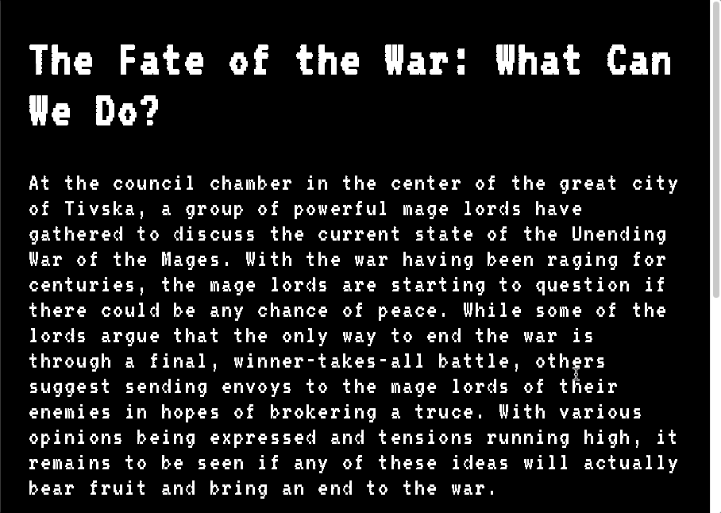

# dnd-ai-tools
`dnd-ai-tools` is an AI assisted dungeon master toolset leveraging openAI's chat API to assist in the generation of campaigns, characters, locations, and most importantly _*conversations between groups of NPCs and Players*_.

This toolset uses a series of prompt functions to generate content. The generated content is stored in a SQLite local database and is then fed back into the prompts to provide the chat API with additional context. The result is a more natural conversation between multiple NPCs and Players where the actors maintain their "voice".



## Setup
1. Navigate into the project directory
1. Install the requirements
   ```bash
   $ npm install
   ```

1. Make a copy of the example environment variables file
   ```bash
   $ cp .env.example .env
   ```
1. Add your [OpenAI API key](https://beta.openai.com/account/api-keys) to the newly created `.env` file

1. Run the app
   ```bash
   $ npm run dev
   ```

You should now be able to access the app at [http://localhost:3000](http://localhost:3000)!


## Usage Instructions
### Campaigns
- Create a campaign by clicking the `+New Campaign` button. This will bring you to a form where you can generate a new campaign.
- You can choose to hit the dice icon to use OpenAI to generate the campaign name or description.
- If you want to pass a custom prompt, enter it into the field before hitting the dice icon.


### Actors
- Create an actor by clicking the `+New Actor` button within a campaign. This will bring you to a form where you can generate a new actor.
- You can choose to hit the dice icon to use OpenAI to generate the actor name or description.
- If you want to pass a custom prompt, enter it into the field before hitting the dice icon. This will still maintain the context of the campaign name and description


### Items
- Create an item by clicking the `+New Item` button within a campaign. This will bring you to a form where you can generate a new item.
- You can choose to hit the dice icon to use OpenAI to generate the item name or description.
- If you want to pass a custom prompt, enter it into the field before hitting the dice icon. This will still maintain the context of the campaign name and description


### Locations
- Create a location by clicking the `+New Location` button within a campaign. This will bring you to a form where you can generate a new location.
- You can choose to hit the dice icon to use OpenAI to generate the location name or description.
- If you want to pass a custom prompt, enter it into the field before hitting the dice icon. This will still maintain the context of the campaign name and description


### Conversations
Conversations are currently the core feature of the app. They allow you to generate conversations between any number of actors in a campaign. The conversation is generated using OpenAI's chat API. The conversation is generated using full context of the campaign, the names and descriptions of the characters speaking, and the description of the conversation they are having.

- Create a conversation by clicking the `+New Conversation` button within a campaign. This will bring you to a form where you can generate a new conversation.
- You can choose to hit the dice icon to use OpenAI to generate the conversation name or description.
- If you want to pass a custom prompt, enter it into the field before hitting the dice icon. This will still maintain the context of the campaign name and description
- Once in a conversation, use the dropdown to select a character, then enter text into the chat box to create a message as that actor.
- You can also use the dropdown to select a character to have a message generated for them by OpenAI.


## TODO
This is still a work in progress and I haven't decided how it will be best utilized. After some testing, I may end up converting this into an interface for having single-player DND adventures. Regardless, here are some features I've considered:
- Add ability to edit campaigns, actors, locations, and conversations
- Add ability to delete campaigns, actors, locations, and conversations
- Add ability to add images to campaigns, actors, locations, and conversations (maybe)
- Improve list UI to allow for more information to be displayed
- Add support for full actor character sheets
- Allow for association of locations to conversations
- Potential "storyline" feature to allow for generation of a campaign storyline.
